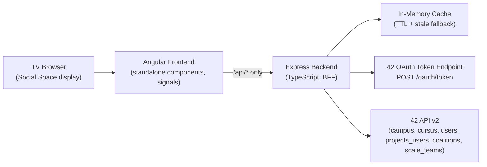
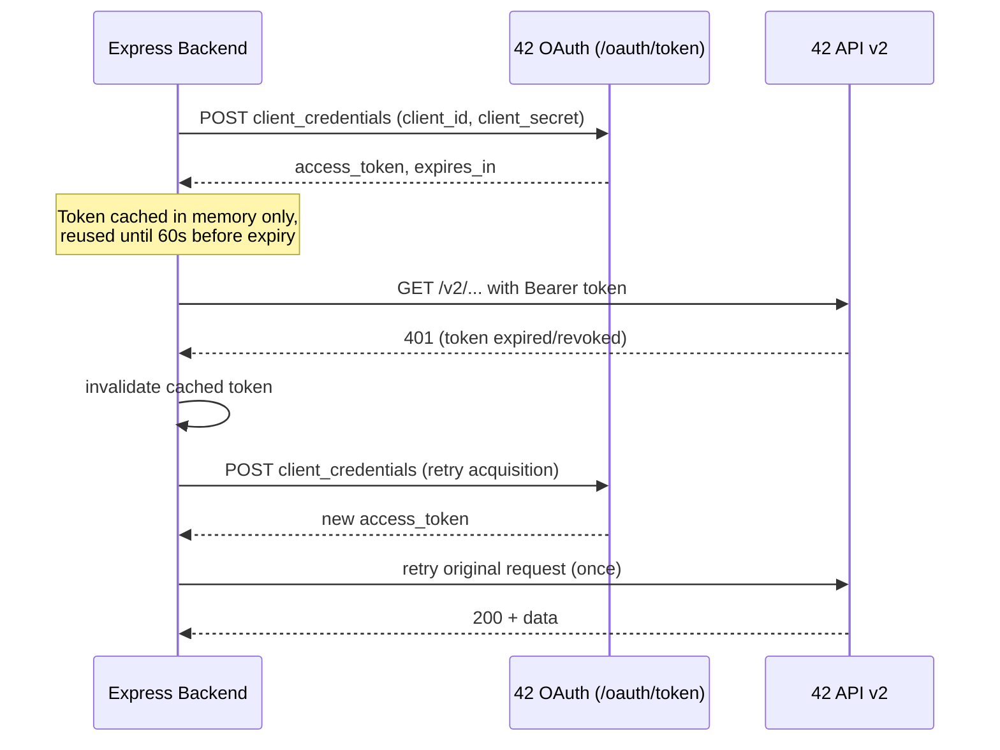

# Architecture

## Goals

1. Show a live, TV-friendly view of 42 Warsaw Common Core learning progress.
2. Never expose 42 API credentials to the browser, Docker image, or logs.
3. Stay resilient to upstream 42 API slowness/outages (stale-cache fallback).
4. Run entirely on live 42 API data - no offline/demo mode.
5. Be simple enough to operate as a hackathon proof of concept, with a clear path to a
   production-hardened version.

## Component overview

```
42-warsaw-progress-insight/
├── frontend/   Angular 22 standalone app (dashboard, students, projects, TV mode)
├── server/     Express + TypeScript backend-for-frontend (BFF)
├── docs/       This documentation set
└── docker-compose.yml, Dockerfiles for both apps
```

## Architecture diagram



## Frontend architecture

- **Standalone components only** - no `NgModule`s. Routes lazy-load each page via
  `loadComponent`.
- **State**: a single `DashboardStore` service (Angular signals) owns loading/refreshing/
  error/stale flags, the polled dashboard dataset, auto-refresh interval/countdown, and the
  selected trend display period. Components read it via `inject()` and render with
  `ChangeDetectionStrategy.OnPush` (the app runs **zoneless**, so signal reads are the only
  thing that schedules a re-render).
- **HTTP**: a thin `ApiService` wraps every `/api/*` call with typed request/response models.
  Two functional interceptors are registered: `errorInterceptor` (normalizes every failure
  into `{ code, message, status }`) and `timingInterceptor` (dev-only request timing to the
  console; no headers or tokens are ever logged - there are none to log, since the frontend
  holds no credentials at all).
- **Polling**: `DashboardStore` runs an RxJS `timer(0, 1000)` tick that pauses when
  `document.hidden` (via a small `VisibilityService`) or when auto-refresh is toggled off,
  and never starts an overlapping fetch (`isFetching` guard).
- **TV mode**: a `TvModeService` holds an `enabled` flag and a rotating `activeSection`
  index. The non-TV desk view always shows all 4 dashboard panels; TV mode instead rotates
  through 5 full-bleed spectacle modes (Hive live node map, Level-Up spotlight, XP race +
  black hole watch, coalition leaderboard, live evaluations) every `rotationSeconds` (default
  15s) while the tab is visible, plus a full-screen achievement takeover overlay that can
  interrupt any mode.
- **Charts**: Chart.js via `ng2-charts`' `BaseChartDirective`; every chart also renders a
  plain-text summary (`aria-label` + visually-hidden `<p>`) for screen readers.

## Backend architecture

- `server/src/index.ts` boots config validation → logger → `AppContext` (dependency
  container) → Express `app`.
- `appContext.ts` wires: `TokenManager` → `Ft42ApiClient` → `DiscoveryService` →
  `DataService` (the aggregation/caching orchestrator) → `StatusService`, all unconditionally
  - `FT42_CLIENT_ID`/`FT42_CLIENT_SECRET` are required at startup (see `config/env.ts`).
- **Routes** (`server/src/routes/*.ts`) are thin: parse/validate query params, call
  `DataService`/pure metric functions, wrap the result in the `{ data, meta }` envelope.
- **Pure functions**: all metric math (`server/src/services/metrics.ts`) and normalization
  (`normalize.ts`) are side-effect-free and unit tested independently of HTTP or the 42 API.

## OAuth flow



## Cache flow

`server/src/utils/cache.ts` (`TtlCache`) is used for: discovered campus/cursus config, the
core student+completion dataset, and the project list. `getOrLoad(key, loader)`:

1. Returns cached data immediately if still within TTL (`cached: false` in a route's `meta`
   is not quite right here - the envelope's `meta.cached` reflects "did this response come
   from cache", and `meta.staleData` reflects "cache is past TTL but being served anyway").
2. If a load for the same key is already in flight, every caller **awaits the same promise**
   instead of firing a duplicate 42 API call (stampede protection).
3. If the loader throws (42 API unreachable) and a previous value exists, the **stale** value
   is returned with `status: 'stale'` rather than surfacing an error to the user.

## Refresh flow

- **Automatic**: `DashboardStore`'s countdown reaches zero → `loadAll()` → `forkJoin` of all
  dashboard endpoints → signals updated atomically on success, or `error`/`lastFailedUpdate`
  updated on failure (existing data is left in place).
- **Manual**: the refresh button calls `POST /api/dashboard/refresh`, which invalidates the
  server-side cache and eagerly reloads it (guarded by `ctx.refreshInProgress` so concurrent
  manual refreshes don't pile up), then the frontend re-fetches every view.

## Deployment design

- **Local, no Docker**: `npm run dev` runs the Express server (`tsx watch`) and `ng serve`
  (with `proxy.conf.json` forwarding `/api` to `localhost:3000`) concurrently.
- **Docker**: `frontend/Dockerfile` builds the Angular production bundle and serves it via
  `nginx-unprivileged`, which also reverse-proxies `/api/*` to the `server` container
  (`frontend/nginx.conf`). `server/Dockerfile` runs the compiled backend as a non-root user.
  `docker-compose.yml` wires both together; the backend's `.env` is supplied via `env_file`
  at **runtime**, never `COPY`'d into the image.
- **TV display**: the browser is pointed at the frontend origin, TV mode is toggled (button
  or `T` key), and the browser is put into fullscreen.

## Security decisions

- The 42 Client ID/Secret exist **only** as backend environment variables, validated at
  startup by a Zod schema (`server/src/config/env.ts`) that fails fast with an actionable
  error message when missing - both are always required.
- All 42 API calls originate from the backend; the frontend's `ApiService` only ever calls
  same-origin `/api/*` paths - never `api.intra.42.fr` directly, and never sends an
  `Authorization` header (there's nothing for it to send).
- The `pino` logger redacts `access_token`, `client_secret`, `token`, and `authorization`
  fields at any nesting depth, so even a coding mistake that logs a whole response object
  can't leak a secret.
- `GET /api/config` and `GET /api/status/42` are deliberately narrow, hand-picked response
  shapes - not a pass-through of any internal config object - so a future field added to
  `AppConfig` doesn't accidentally become public.
- Helmet is applied globally; CORS is restricted to `FRONTEND_ORIGIN` (a single configured
  origin, intended for local development only, per the project's read-only/no-auth scope).
- Error responses never include stack traces or raw upstream bodies - see
  `server/src/middleware/errorHandler.ts`.

## Production evolution plan

This proof of concept intentionally avoids a database and uses a single in-memory cache
instance. A production version would add:

- **Redis** for the cache layer, so multiple backend replicas share one cache and survive
  restarts without a cold-start "no data" window.
- **PostgreSQL** (or a time-series store) to retain historical completions beyond what the 42
  API's own pagination window conveniently returns, enabling longer trend charts and
  point-in-time snapshots instead of always querying "current state."
- A scheduled background refresh job (rather than only refreshing on-demand from an HTTP
  request) so the cache is warm before the TTL expires.
- Structured observability: request tracing, metrics (cache hit rate, 42 API latency/error
  rate), and alerting on sustained 42 API unavailability.
- Optional lightweight auth in front of the manual-refresh endpoint if the dashboard is ever
  exposed outside the physical Social Space network.

See `docs/LIMITATIONS.md` for the full list of known proof-of-concept trade-offs.
